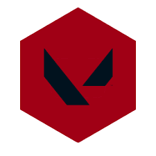

# ValoClub 

ValoClub é uma aplicação Laravel integrada com SCSS, focada em facilitar a busca de parceiros para jogar Duo.

## Como Rodar a Aplicação

Para executar a aplicação localmente, siga os passos abaixo:

### Pré-requisitos

Certifique-se de ter as seguintes ferramentas instaladas em seu ambiente de desenvolvimento:

- [Node.js](https://nodejs.org/) (para gerenciar pacotes JavaScript) 📦
- [Composer](https://getcomposer.org/) (para gerenciar dependências PHP) 🎶
- Um servidor web local como XAMPP, ou equivalente de sua preferência 🌐

### Instalação das Dependências

1. **Instalação das Dependências PHP**:
   
   Se for a primeira vez que está executando o projeto, execute o seguinte comando no diretório do projeto para instalar as dependências PHP:

   ```bash
   composer install
   ```

2. **Instalação das Dependências JavaScript**:

    ```
    npm install
    ```

### Configuração da Aplicação

1. **Gerar Application Key**:

    ```
    php artisan key:generate
    ```

2. **Configurar arquivo .env**

    ```
    copie o arquivo .env.example e retire o .example e configure para o seu banco
    ```

### Executando Aplicação

1. **Iniciando servidor**:

    ```
    php artisan server
    ```

2. **Iniciando o compilador para o front-end**:

    ```
    npm run dev
    ```

#### Pronto, a aplicação já deve está sendo executada no seu localhost :smile:


